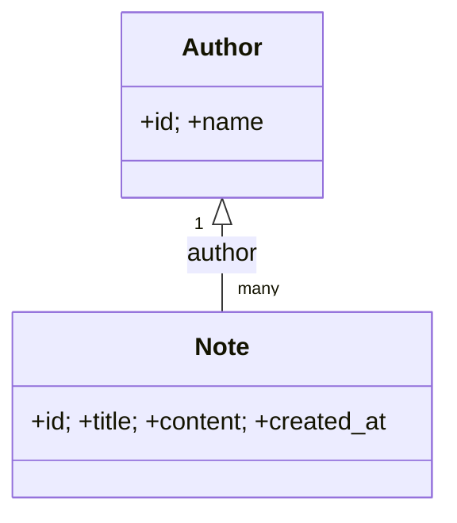

# Sticky Notes – Design (Part 2)
- Same as Part 1, with a required `author` on notes and new author screens.

```mermaid
classDiagram
class Author {+id; +name}
class Note {+id; +title; +content; +created_at}
Author "1" <|-- "many" Note : author
```
